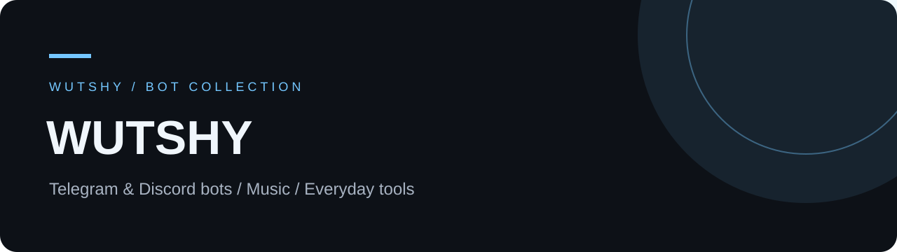

**Bots for everyday life, creative work and online communities.**  
**Боты для повседневной жизни, творчества и онлайн-сообществ.**

[English](README.md) · [Русский](README.ru.md) · [Portfolio / Портфолио](https://wutshy.vercel.app/)

---

## ⭐ Flagship project

### [DotaAccept](https://github.com/wuttashi1/DotaAccept)

**Fewer clicks. More game.** My main project: a Windows companion for Dota 2 with match acceptance actions, hero pick sequences, customizable hotkeys and Telegram control.

[Download for Windows](https://github.com/wuttashi1/DotaAccept/releases/latest) · [Explore the project](https://github.com/wuttashi1/DotaAccept) · [English documentation](https://github.com/wuttashi1/DotaAccept/blob/main/README.en.md)

`Windows 10 / 11` · `Telegram` · `Hotkeys` · `RU / EN docs`

---

## Featured bots

### [🥗 Food Planner](https://github.com/wuttashi1/food-planner-bot)

[▶ Open bot / Открыть бота](https://t.me/wutshyfoodplanner_bot)

Weekly meal plans, shared groceries, nutrition and Excel workflows.

### [🏋️ Fitness Bot](https://github.com/wuttashi1/fitness-bot-mvp)

[▶ Open bot / Открыть бота](https://t.me/TrenirovkaWSBot)

Workout tracking, personal programs, progress and a community workshop.

### [🎵 Beat Cover & BPM](https://github.com/wuttashi1/Beat_cover-bmpbot)

Cover artwork, BPM timestamps, MP3 tags and publishing tools.

### [🌸 Anime Wutshy](https://github.com/wuttashi1/animewutshybot)

Discord anime cards, forum topics, personal lists and API integrations.

### [🛡️ Activity Manager](https://github.com/wuttashi1/Inactivebot)

Telegram group activity reports, reminders and scheduled cleanup.

---

### More projects

[Telegram × n8n](https://github.com/wuttashi1/n8nstart) · [Music portfolio](https://wutsh-ysite.vercel.app)
